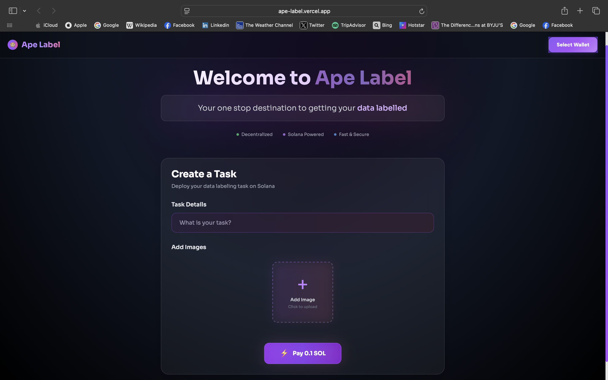

# Ape Label: The Future of Decentralized Work

_Empowering a Global Workforce, Task by Task._

🔗 [https://ape-label.vercel.app/](https://ape-label.vercel.app/)

Above: A look at Ape Label's intuitive platform, connecting talent with opportunity.

## The Challenge in Today's Work Landscape

The global freelance and gig economy is expanding rapidly, projected to grow to $8.39 billion in 2025 at a compound annual growth rate (CAGR) of 14.5% from 2024. While this growth signifies unprecedented flexibility, it also exposes systemic issues in traditional platforms:

1. Excessive Fees: Centralized platforms extract substantial commissions, diminishing the earnings of talented individuals.

2. Trust Deficits: Opacity in payment processing and task verification often leads to disputes and a lack of confidence.

3. Centralized Vulnerability: Traditional systems are prone to censorship, data breaches, and unilateral policy changes.

4. Delayed Payouts: Cumbersome financial intermediaries impede the rapid flow of funds to a workforce that often relies on timely payments.

Ape Label is engineered to transform this paradigm. We are building a truly decentralized, transparent, and equitable marketplace, eliminating friction and fostering trust in every interaction.

## Our Solution: Ape Label

Ape Label is a pioneering Web3 SaaS platform, a decentralized task marketplace meticulously designed to address the inefficiencies and inequities inherent in traditional freelance models. We provide a robust environment where individuals and businesses can connect and collaborate with unprecedented freedom and security:

1. Direct, Cost-Efficient Transactions: Leveraging the Solana blockchain, Ape Label facilitates transactions with average fees of $0.02 or less, ensuring more value is retained by the talent completing the tasks.

2. Immutable Trust and Transparency: Every payment and task completion is recorded on the public Solana ledger, offering verifiable proof and eliminating the potential for disputes.

3. User Sovereignty: Our wallet-based authentication empowers users with complete control over their funds and digital identity, free from centralized intermediaries or restrictive platform policies.

4. Global Accessibility: Ape Label is universally accessible, connecting a worldwide talent pool with diverse opportunities, thereby democratizing access to work.

5. Real-time Verification: Our on-chain verification system provides instant confirmation of task milestones and payments, streamlining the work cycle and ensuring prompt settlements.

Ape Label is more than just a platform; it's a foundational shift towards a more equitable and efficient global work economy.

## How It Works: The Mechanics of Decentralization

Ape Label seamlessly integrates established Web2 and cutting-edge Web3 technologies to deliver a fluid and secure user experience:

1. User Interface (Next.js Frontend): Users engage with an intuitive and responsive interface to browse, post, accept tasks, and manage their activity within the marketplace.

2. Wallet Integration: Users connect their Solana wallets (e.g., Phantom, Solflare) directly from their browser for secure authentication and transaction authorization, bypassing traditional login systems.

3. Application Logic (Node.js/Express.js Backend): Our robust backend manages off-chain task metadata and user profiles, and orchestrates interactions with the blockchain, preparing and verifying transaction instructions.

4. On-Chain Transactions (Solana Blockchain): All critical financial transactions (SOL transfers for payments) and key task state changes are executed and immutably recorded on the Solana blockchain.

5. Transaction Verification: The backend continuously monitors the Solana network, confirming transaction successes and updating the corresponding task statuses within the application.

## Why Ape Label Stands Out: Our Strategic Advantages

1. Unrivaled Speed and Cost-Effectiveness: Building on Solana's high-throughput architecture provides Ape Label with a distinct advantage in transaction speed and minimal costs, essential for a dynamic marketplace.

2. Focus on Trust and Disintermediation: We fundamentally eliminate the need for costly and slow intermediaries, fostering direct, transparent connections between service providers and seekers.

3. Future-Ready Infrastructure: By embracing core Web3 principles, Ape Label is designed to evolve with the decentralized internet, offering a resilient and secure platform.

4. Scalable Architecture: The chosen technology stack supports future growth and the integration of advanced features, ensuring the platform can scale with user demand.

## Market Opportunity

The global freelance market is projected to reach $8.39 billion in 2025, with continued rapid growth fueled by the expansion of the gig economy, remote work trends, and the increasing adoption of blockchain and smart contracts. The broader Web3 market is also experiencing substantial growth, projected to reach $3.47 billion in 2025 and $41.45 billion by 2030, driven by enterprise blockchain adoption and decentralized applications.

Ape Label is uniquely positioned to capture a significant share of this burgeoning market by offering a superior, more equitable, and transparent alternative to existing centralized platforms. We aim to serve:

- Global Freelancers and Gig Workers: Providing enhanced earning potential and faster access to funds.

- Small and Medium Businesses (SMBs): Offering a streamlined, cost-effective avenue for accessing specialized talent worldwide.

- Web3 Native Organizations: A natural and preferred platform for decentralized projects seeking talent aligned with their ethos.

## Core Technical Components

Frontend: Next.js (React framework)

Backend: Node.js with Express.js

Blockchain: Solana

Blockchain Interaction Library: @solana/web3.js

Asset Storage: AWS S3

## Roadmap & Future Vision

Ape Label is committed to continuous innovation and expansion. Our strategic roadmap includes:

### Phase 1: Core Marketplace Enhancement

Development of advanced task filtering, search, and recommendation algorithms.

Implementation of a user feedback and rating system to enhance trust and quality.

Refinement of the user interface for even greater intuitiveness and accessibility.

### Phase 2: Advanced Web3 Integrations

Introduction of custom Solana programs for sophisticated features like decentralized escrow, automated milestone-based payments, and on-chain dispute resolution.

Integration of support for various SPL tokens for payment flexibility.

Exploration of decentralized identity (DID) solutions for enhanced user privacy and verifiability.

### Phase 3: Ecosystem Expansion & Scalability

Development of a robust notification system for real-time updates.

Implementation of analytics dashboards for users to track earnings and task history.

Investigation of cross-chain interoperability to expand the marketplace's reach.

MIT License © 2025 Vasvi Garg
